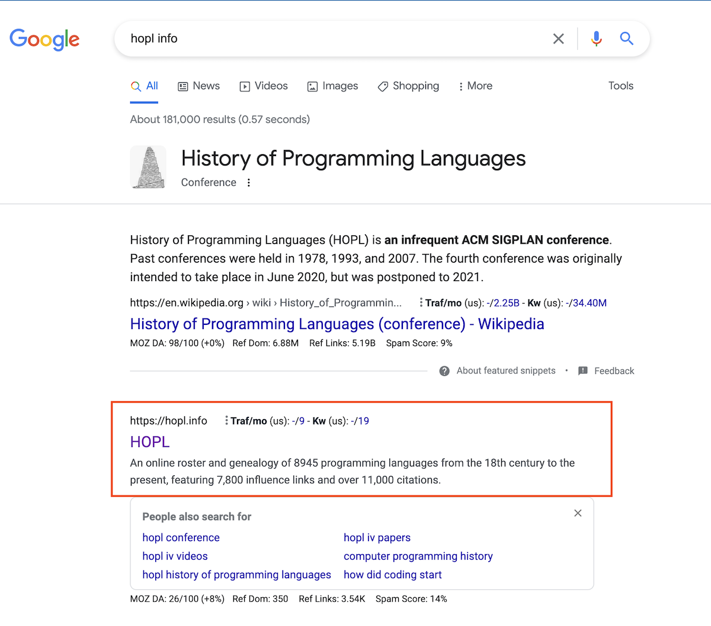

Before jumping into the top 10 list, here is a quick quiz for you! 

**Can you guess how many computer programming languages exist in this world?**

Try to guess a number without googling and look for the answer in the bottom of this post once your read the top 10 list :-)

While the guess work is going on, out of all programming languages, 50 are the most used ones. Many of us stick with couple of main languages, there are indeed favorite ones for each of us and StackOverflow did a survey to understand most loved programming, scripting and markup languages. Let's look at the top 10 most loved programming languages of 2022 and which companies are using them based on 71,547 developers report.

Since each language works differently, here are two quick tips for beginners to understand some key terms

#### What is a statically-typed language ?

A statically-typed language is a language (such as Java, C, or C++) where the variable types are known at compile time. So example : String a = "b" . Here we define String as a variable type at compile time itself.

#### What is a dynamically typed language ?
In dynamically typed language (Eg: Javascript, Python), variable types are interpreted at runtime. Eg: a = "b"  . Here type of variable a is determined at runtime.

**Alright! here we go. Top 10 most loved programming languages of 2022 and  which companies are using them?**

# #1: Rust

Rust is a blazingly fast, memory efficient statically-typed programming language designed for performance and safety. Concurrency and memory management are some of the key highlights. It can run on embedded devices and its easy to integrate with other systems while maintaining Reliability and Productivity.

86.73% love rust as per Stack Overflow Developer Survey 2022.

#### Top companies using Rust

- Whatsapp
- Dropbox
- Figma
- Discord
- Cloudflare
- Facebook

# #2: Elixir

Elixir is a dynamic, functional language that leverages Erlang Virtual Machine. While Erlang is and old language created in 1980s Elixir involved as a new language to take advantage of its parallel and concurrent computation. Its best for running low-latency distributed, and fault-tolerant systems and also been used for Web development , multimedia processing too.

75.46% loved Elixir based on Stack overflow report.

#### Top companies using Elixir
- Heroku
- Discord
- FarmBot
- Slab
- Duffel

# #3: Clojure

Clojure is a compiled language and is a dialect of Lisp and shares lot of code and powerful macro system. Its a dynamic, general-purpose programming language, combining the approachability and interactive development of a scripting language with an efficient and robust infrastructure for multithreaded programming. It runs on the JVM, CLR, Node.js, and modern mobile and desktop web browsers.

75.23% loves Clojure in 2022.

#### Top companies using Clojure
- Netflix
- Amazon
- WalmartLabs
- SoundCloud
- LivingSocial

# #4: TypeScript

This is one of the favorites for frontend developers. TypeScript adds additional syntax to JavaScript to support a tighter integration with your editor to catch errors early in the development. TypeScript is a strongly typed programming language that builds on JavaScript, giving you better tooling at any scale.

73.46% developers like to use TypeScript with Javascript based on StackOverflow.

#### Top companies using TypeScript
- Slack
- Medium
- Thumbtack
- Accenture
- CircleCI

# #5: Julia

If you want to combine Speed similar to C/C++ while maintaining the usability of python, Julia language is your best bet. It's a dynamically typed, feels like a scripting language with high performance used in many data science applications.

72.51% loved using Julia in 2022.

#### Top companies using Julia
- Microsoft
- Moderna
- Pfizer
- NASA
- Intel

# #6: Python
I don't think Python requires introduction :-) . Its a dynamically typed programming language that lets you work more quickly and integrate your systems more effectively.
Multiple applications in data science , machine learning and very beginner friendly.

67.34% liked to used python in 2022 as per stackoverflow developer insights.

#### Top companies using Python
- Intel
- Facebook
- Google
- Coupang
- Spotify

# #7: Delphi
Delphi is a high-level, compiled, strongly typed language that supports structured and object-oriented design. It's a language + IDE based on Pascal compiler. Delphi's compilers generate native code for Microsoft Windows, macOS, iOS, Android and Linux.

65.51% like to use Delphi. It has specific used c

####  Top companies using Delphi
- Barogo
- QIWI
- albelli
- Conseil
- MediaSolution

# #8: Go
Golang is a fast, reliable, and efficient open source programming language supported by Google. It's statically typed, compiled language that is easy  to learn and get started with Built-in concurrency and a robust standard library. It's one of the fast growing languages used in many backend applications too.

64.58%  love using Go. Definitely worth giving it a try.

#### Top companies using Go
- Google
- Paypal
- Twitter
- Netflix
- Microsoft

# #9: SQL
SQL stands for Structured Query Language and is used to communicate with a databases. It is the standard language for relational database management systems for different kind of CRUD operations. Some of the databases implementing SQL are MySQL, PostgreSQL , MsSQL.
Kick start learning SQL by observing the difference between PostgreSQL vs MySQL by checking here [TipSeason PostgreSQL vs MySQL Syntax](https://tipseason.com/postgres-vs-mysql-syntax-comparision/)

We are launching an online SQL course based on DBT (data build tool) for beginners with practical hands on project.
First 20 people to signup for the course, will get course for free and next 30 people will get a 50% discount. Make sure to signup here.

If you are not sure about what DBT is, its one of the fast growing framework used in data analytics. You can learn more about it here [DBT Tutorial for beginners](/DBT-tutorial-real-world-scenario-guide/)



#### Top companies using SQL
Used by every company using backend databases.

64.25% love SQL. This is a must learn domain specific language for any kind of database .

# #10: C# #
C# (pronounced "See Sharp") is a modern, object-oriented, and type-safe programming language similar to Java OOPs.  It's developed by Microsoft and used in various different applications including .NET, windows based applications

#### Top companies using C#
- Microsoft
- Stack Overflow
- Accenture
- Aristocrat
- Nuance

63.38% like to use C#

# Java

While many of us use Java for real world programming , it's not ranked in the top 10 as per the StackOverflow most loved languages.

Only 45.75%  love to use Java.

####  However most top companies use Java
- Google
- Facebook
- Airbnb
- Amazon
- Uber and many more.

Source of this data analysis is the [StackOverflow Developer Survey 2022](https://survey.stackoverflow.co/2022/#technology-most-loved-dreaded-and-wanted)

# Carbon language 

As you got to know about top 10 most loved programming languages, Google recently introduced Carbon programming language as a successor to C++. 
Given that Rust is in the top #1 list of most loved programming language , there is a hug community discussion if carbon language is a competition to Rust. If you want to learn more about carbon language 
you can read this here  [Carbon language tutorial](/carbon-language-tutorial-syntax)

> * Bonus content:
> Top Coding interview problems and solutions: 
> If you preparing for coding interview here are the top 30 coding interview list.
>
> [https://tipseason.com/coding-interviews.html](https://tipseason.com/coding-interviews.html)

Although there are 50 that are the most popular programming languages in use today.

#### Alright here is the answer for our quiz for how many programming languages exist in this world ?

Well as expected the answer is a variable. There are 3 most referred sources for the actual count.
1. [Wikipedia](https://en.wikipedia.org/wiki/List_of_programming_languages) : As per wikipedia there are about **700** of the notable notable programming languages, in current or historical use.
> This is an index to notable programming languages, in current or historical use. Dialects of BASIC, esoteric programming languages, and markup languages are not included. A programming language does not need to be imperative or Turing-complete, but must be executable and so does not include markups such as HTML or XML, but does include domain specific languages such as SQL and its dialects.

2. [PLDB](https://pldb.pub/lists/languages.html) Which tracks programming languages, currently has 3907 languages indexed in its database.

3. [HOPL](#) Stands for History of Programming Languages claims to have 8945 programming languages.

In our rough guess at TipSeason, there could be more than 20,000 programming languages including different variations of programming, markdown, sql etc.

If you have any other better suggestions or sources , drop a comment below.

As a knowledge check,

**Which countries produce the most programming languages? Drop your answers below. **
